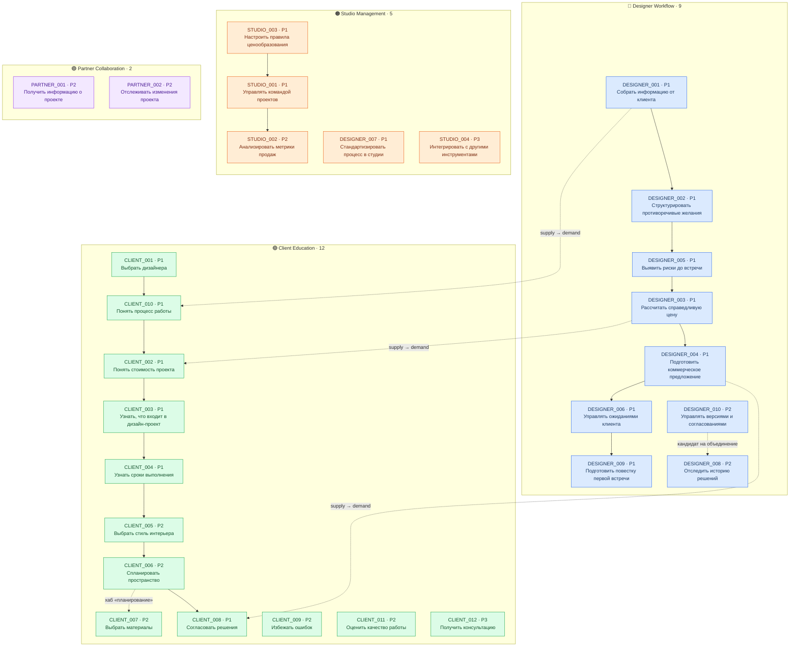

# Граф интентов — RemHaOS (28 интентов)

**Источник данных:** `intent-registry.json` (узлы) + `Intent Hierarchy & Relationships` (рёбра).
**Дата сборки:** 5 августа 2026.
**Визуальная версия:** [`intent-graph.html`](./intent-graph.html) — 4 колонки, размер узла = приоритет.

---

## Легенда

| Элемент | Значение |
|---------|----------|
| 🔵 синий | Designer Workflow — 9 интентов |
| 🟢 зелёный | Client Education (путь клиента) — 12 интентов |
| 🟠 оранжевый | Studio Management — 5 интентов |
| 🟣 фиолетовый | Partner Collaboration — 2 интента |
| Крупный / средний / мелкий узел | P1 / P2 / P3 |
| Сплошная стрелка | Последовательность внутри сегмента |
| Красная пунктирная стрелка | Кросс-связь дизайнер ↔ клиент |
| Серая пунктирная линия | Тематическое пересечение (см. `intent-duplicates.md`) |

Кластер `Client Education` в реестре = «путь клиента» (Client Journey) в описании последовательностей — это одно и то же множество из 12 интентов, разные названия в исходных документах.

---

## Граф



---

## Последовательности

### Designer Workflow — линейный пресейл

```
DESIGNER_001 → DESIGNER_002 → DESIGNER_005 → DESIGNER_003
             → DESIGNER_004 → DESIGNER_006 → DESIGNER_009
```

Вне цепочки: `DESIGNER_008` и `DESIGNER_010` — оба P2, оба про отслеживание изменений, обслуживают проект уже после старта, а не последовательность пресейла. Это же и есть единственная пара реального риска каннибализации (см. `intent-duplicates.md`).

### Client Education — путь принятия решения

```
CLIENT_001 → CLIENT_010 → CLIENT_002 → CLIENT_003
           → CLIENT_004 → CLIENT_005 → CLIENT_006 → CLIENT_008
```

Вне цепочки: `CLIENT_007` (материалы — примыкает к блоку планирования), `CLIENT_009`, `CLIENT_011`, `CLIENT_012` — самостоятельные информационные входы, не привязанные к шагу воронки.

### Studio Management

```
STUDIO_003 → STUDIO_001 → STUDIO_002
```

Вне цепочки: `DESIGNER_007` (несмотря на префикс `DESIGNER_`, сегмент и кластер — studio) и `STUDIO_004`.

### Partner Collaboration

`PARTNER_001` и `PARTNER_002` — независимые, последовательность не задана.

---

## Кросс-связи сегментов

Три пары «предложение → спрос»: одно событие воронки, две стороны стола.

| Дизайнер (supply) | Клиент (demand) | Общее событие |
|---|---|---|
| DESIGNER_001 Собрать информацию | CLIENT_010 Понять процесс работы | Старт проекта, сбор брифа |
| DESIGNER_003 Рассчитать цену | CLIENT_002 Понять стоимость | Ценообразование |
| DESIGNER_004 Подготовить КП | CLIENT_008 Согласовать решения | Отправка и приём КП |

Это не дубли — это парные интенты. Каждая пара требует взаимной ссылки, а не слияния.

---

## Что граф не показывает — и почему

1. **В реестре нет рёбер.** У всех 28 записей `parent_intent: null` и `child_intents: []`. Вся структура графа взята из отдельного документа `Intent Hierarchy & Relationships`, не из `intent-registry.json`. При любой автоматизации (генерация перелинковки, sitemap, хлебные крошки) реестр как источник иерархии использовать нельзя — сначала нужно перенести рёбра в поля `parent_intent` / `child_intents`.
2. **Приоритет узла отражает P1/P2/P3, а не объём трафика.** Частотность запросов в исходных данных отсутствует; `seo_difficulty` проставлена экспертно, `confidence` у всех 28 записей одинакова — 0.85, то есть это константа по умолчанию, а не измеренная величина.
3. **4 из 12 клиентских и 2 из 5 студийных интентов вне заданных последовательностей** — это не ошибка графа, а пробел в исходной иерархии.
