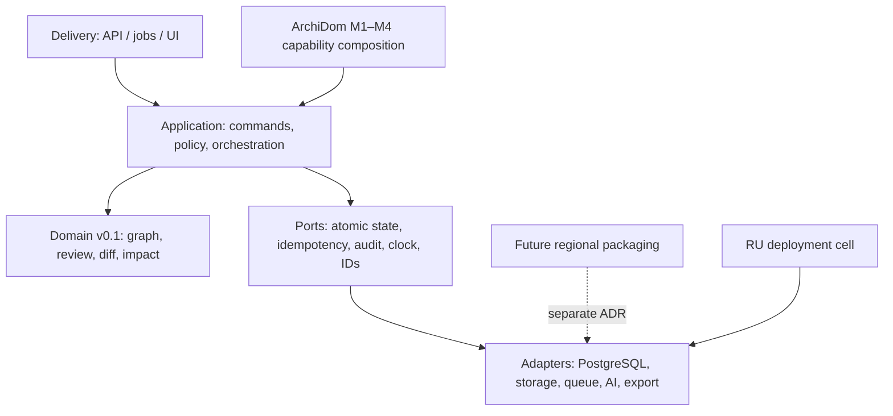

# Project Intelligence Architecture v1

> **Compatibility notice, 18 июля 2026 года.** Product/edition naming в разделах
> 1 и 9 superseded утверждённым
> `ArchiDom_Russia_Product_Charter_v0.4_2026-07-18.md` и ADR-0004. Публичный
> продукт теперь один — ArchiDom с четырьмя ролевыми рабочими пространствами;
> текущий delivery остаётся RU-only. `ProjectCEO` сохраняется только как internal
> compatibility namespace, ProUp как отдельная редакция отменён. Layered modular
> monolith, provenance, exact revisions, immutable versions, deterministic impact,
> server-derived scope и остальные технические инварианты Architecture v1 остаются
> принятыми.

Дата фиксации: 16 июля 2026 года.
Статус: **accepted для application-level vertical slice**.
Основание: принятые `Project Intelligence Domain v0.1`, vertical-slice contract/fixtures и
Wave 1 integration report.

Текущий delivery scope: **только RU**. RU deployment cell — единственная цель
разработки, пилота и production-adoption на этой фазе. Северная Америка остаётся
будущей региональной упаковкой того же ArchiDom и не получает runtime, отдельную
кодовую базу или production-валидацию до принятия RU.

## 1. Решение

Компания строит **одно Project Intelligence Core** внутри одного публичного ArchiDom.
Четыре ролевых рабочих пространства M1–M4 композируют capabilities поверх общей
Organization/Project модели. Текущий физический deployment-контур один — `ru`.
Будущая североамериканская упаковка обязана использовать то же ядро, но её data-plane
и operational boundary принимаются отдельным ADR до реализации.

Архитектурная форма P0 — **слоистый модульный монолит**. Разделяются доменные границы,
application services, ports и adapters, но не создаются преждевременные микросервисы.

Architecture v1 заменяет `architecture-v0.1.md` как рабочую точку реализации. ADR
`0001–0003` и неизменившиеся решения v0.1 сохраняют силу.

## 2. Что именно фиксируется в v1



Направление зависимостей строго сверху вниз:

1. `domain` не импортирует Next.js, Supabase, edition, region, UI или AI provider;
2. `application` импортирует только public domain API и собственные ports;
3. adapters реализуют ports, но не меняют domain policy;
4. delivery преобразует transport DTO в команды, но не содержит бизнес-правил;
5. edition-модули композируют capabilities, а не форкают ядро.

## 3. Слои и ответственность

| Слой | Владеет | Не владеет |
|---|---|---|
| Domain | graph invariants, exact-revision review, semantic diff, deterministic impact | auth, persistence, timestamps, IDs, audit storage |
| Application | use-case order, role/capability checks, optimistic concurrency, change reason, idempotency contract, audit intent | HTTP, SQL, signed URLs, rendering |
| Ports | atomic commit boundary и контракты внешних зависимостей | vendor-specific implementation |
| Adapters | PostgreSQL/RLS, object storage, durable jobs, providers, renderers | изменение domain semantics |
| Delivery | authenticated request mapping, controlled errors, response DTO | доверие к client-supplied actor/region/role |
| Workspace composition | M1–M4 journeys, templates, role/capability surfaces | дублирование graph/version/provenance core |

## 4. Канонический application aggregate

Первый aggregate называется `ProjectIntelligenceWorkflow`. Он объединяет только то, что
должно меняться атомарно в одном project scope:

- текущий draft graph snapshot;
- опубликованные immutable version snapshots;
- human reviews exact revisions;
- change sets с `who / when / why`;
- impact runs и human dispositions;
- logical handoff descriptors;
- монотонный `stateRevision` для optimistic concurrency.

Это логическая граница. Она **не утверждает** будущую форму таблиц и не разрешает хранить
aggregate одним JSONB blob. Persistence mapping принимается отдельно после database gate.

## 5. Первый сквозной путь

```text
source-linked extracted graph
  → human review exact revision
  → publish immutable V1
  → revise one confirmed decision with reason
  → publish immutable V2
  → semantic diff V1→V2
  → deterministic impact run on V2-active edges
  → human impact dispositions
  → deterministic logical handoff + semantic hash
```

В Wave 2 выполняется уровень `L1`: application orchestration и исполняемый сценарий на
test adapters. Уровень `L2` — durable transactions, RLS, API, jobs и real renderer — не
считается пройденным.

## 6. Application contract

### 6.1 Server context

Application command получает actor и deployment context только из доверенного caller:

```text
ActorContext = actorId + actorType + organizationId + projectId + capabilities
ExecutionContext = ActorContext + serverTime + requestId
```

Client payload не может назначать actor, organization, region, роль или server timestamp.
Для human review `actorType` обязан быть `human`.

### 6.2 Command envelope

Каждая mutation содержит:

- непустой `idempotencyKey`;
- canonical request digest, вычисляемый до commit;
- project-scoped optimistic field (`expectedStateRevision`, `expectedRevisionId` или
  `expectedLatestVersionId`);
- controlled reason code и непустой reason там, где меняется подтверждённое решение.

Одинаковый key + digest возвращает тот же logical result. Одинаковый key + другой digest
возвращает `IDEMPOTENCY_CONFLICT`. L1 доказывает semantics на test adapter; durable и
межпроцессная гарантия относится к L2.

### 6.3 Atomic commit port

Application layer не вызывает независимо `save`, `append audit` и `put idempotency`.
Port задаёт единую логическую операцию:

```text
load(projectId)
commit(expectedStateRevision, commandIdentity, nextState, auditEvents)
```

Production adapter обязан сделать state transition, idempotency record и append-only
audit атомарными. L1 test adapter моделирует этот контракт, но не доказывает database
atomicity.

### 6.4 Stable outcomes

Application failures возвращаются как controlled result/error с кодом, а не как
неструктурированная строка. Минимальный allowlist L1:

- `ACCESS_DENIED`;
- `PROJECT_NOT_FOUND`;
- `PROJECT_SCOPE_VIOLATION`;
- `REVISION_STALE`;
- `VERSION_STALE`;
- `STATE_STALE`;
- `IDEMPOTENCY_CONFLICT`;
- `INVALID_TRANSITION`;
- `CHANGE_REASON_REQUIRED`;
- `EVIDENCE_ACK_REQUIRED`;
- `IMPACT_STALE`;
- `DOMAIN_CONTRACT_VIOLATION`.

Domain error codes не переименовываются; application mapping хранит original code в
controlled details.

## 7. Версии, diff и impact

1. Stable node ID переживает изменения; новая информация создаёт immutable revision.
2. Published version выбирает exact revision для каждого node и после publication не
   меняется.
3. ChangeSet хранит from/to version, human actor, server time, reason code и reason.
4. Diff вычисляется только через frozen `diffProjectVersions`.
5. Impact roots берутся только из `changedNodeIds(diff)`, не из client payload.
6. Edges выбираются для exact target version до вызова domain impact.
7. Impact traversal выполняется только через frozen propagating relations.
8. LLM может объяснить уже вычисленный impact, но не добавляет и не удаляет impacted
   nodes.
9. Human disposition не переписывает исходный impact run.

## 8. Handoff contract

Handoff строится из exact published version и exact impact run. Он разделяет logical
content и volatile artifact metadata.

- canonical objects сортируются по Unicode code point;
- object keys canonicalized recursively;
- массивы имеют явно определённый contract order;
- hash: SHA-256 от UTF-8 canonical logical content;
- artifact ID, timestamps, job status и signed URL не входят в semantic hash;
- повторная сборка одинакового logical content даёт тот же hash.

Wave 2 строит `logical_json`; PDF/DOCX/XLSX/CSV renderers относятся к adapters/L2.

## 9. Регион и рабочие пространства

Domain и application types не содержат ветвлений по публичному модулю или будущему
региону. Внешняя композиция передаёт policy:

- capability set;
- locale/display units;
- canonical currency/unit rules;
- document templates;
- provider adapters и retention policy.

На текущем этапе существует только RU cell. Если появится второй регион, project
content, storage, logs и backups не пересекают cells; общими могут быть код,
одобренные миграции, обезличенные templates и schema versions. До отдельного ADR это
архитектурный инвариант, а не разрешение строить multi-region runtime.

## 10. Security invariants

- actor, role, organization, project и region выводятся server-side;
- все reads/writes project- и organization-scoped;
- public grants hashed, expiring и revocable;
- source bytes, excerpts, free-text reasons, filenames и signed URLs не попадают в
  structured logs/analytics;
- audit append-only; cascade deletion audit history запрещена;
- AI/system actor не создаёт human review;
- client не передаёт changed node IDs, graph edges или resolved impact list как источник
  истины;
- будущие `SECURITY DEFINER` functions имеют fixed `search_path`, minimal grants и
  explicit revoke.

## 11. Разрешённый Wave 2 scope

Разрешено:

- новые application modules под `lib/project-intelligence/application/**`;
- unit/contract tests в новых изолированных paths;
- test-only in-memory adapters;
- docs, reports и root-owned integration test;
- использование только synthetic fixtures.

Запрещено до `BASELINE_READY=true` и отдельного approval:

- `supabase/migrations/**` и production database;
- app/API routes, UI, auth/RLS wiring;
- package/config changes;
- deploy, commit, push;
- чтение production PII/content;
- утверждение, что L1 test adapter доказывает L2 durability.

## 12. Gates

| Gate | Условие | Что открывает |
|---|---|---|
| A1 | Architecture v1 + L1 spec frozen | параллельную Wave 2 реализацию |
| A2 | ownership snapshot, no overlapping paths | запись агентов в isolated scopes |
| A3 | workflow contract tests pass | integration с impact/handoff |
| A4 | change-impact/handoff contract tests pass | root cross-module test |
| A5 | end-to-end L1 test + typecheck/lint/full tests/build | accepted L1 slice |
| DB1 | materialized Git + authoritative migration ledger + security blockers resolved | design of additive persistence wave |
| DB2 | disposable DB bootstrap/RLS/concurrency/idempotency tests | API/UI integration proposal |

Не пройденный `DB1` не блокирует A1–A5, но запрещает выдавать A5 за production-ready.

## 13. Изменение v1

Новый ADR обязателен, если меняются: stable identity/revision model, provenance chain,
direction/relations impact traversal, version immutability, atomic application boundary,
regional isolation или edition composition. Локальные имена private helpers ADR не
требуют.

## 14. Дополнение пользовательского процесса — 24.09.2026

По запросу владельца целевая архитектура дополнена [маршрутом Aldo 01–07](REMHAOS_ALDO_WORKFLOW_ARCHITECTURE_2026-09-24.md): кабинет проекта, клиентское согласование, чек-лист документации, комплект подрядчику, сравнение предложений, контроль этапов работ, журнал площадки, приёмка и гарантийный архив.

Семь этапов размещаются внутри существующих четырёх ролевых пространств одного проекта. Это требования к развитию, не утверждение об их реализации или production readiness. Подписанные ограничения и действующие gates сохраняются. Порядок работ и критерии приёмки заданы в [дополнительном ТЗ](../execution/REMHAOS_ALDO_WORKFLOW_ADDITIONAL_TZ_2026-09-24.md).
